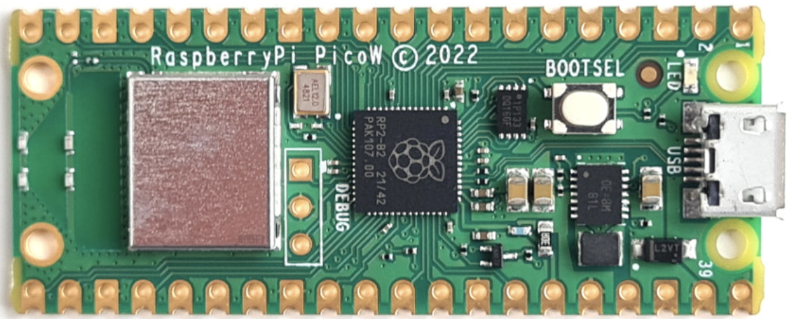
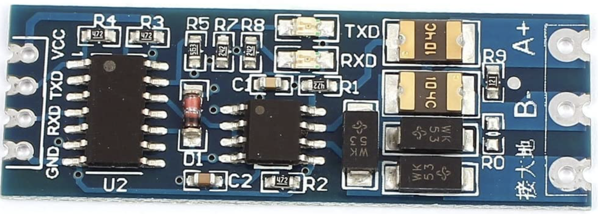
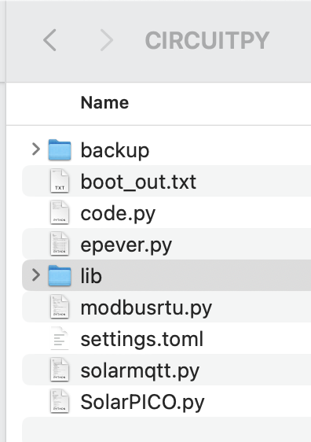
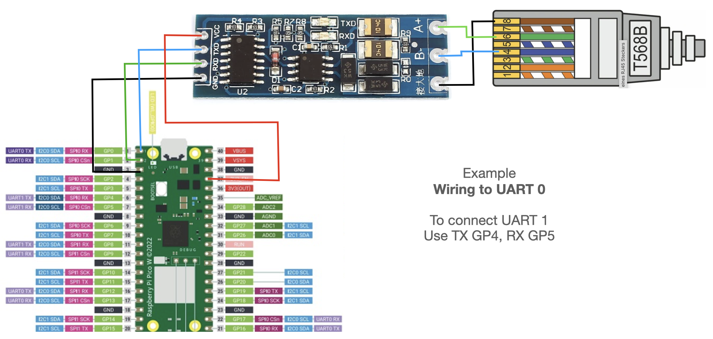

# EPEVER solar charger - ModBus via RP2040 CircuitPython
Written in CircuitPython for a Raspberry RP2040 PICO W board. The software run asynchronously an read all configured registers out from the EPEVER device.
Via MQTT data can be send to a MQTT-Broker (in my case ioBroker with installed MQTT extension)

> Please NOTE: Exception handling is poor implemented. Will work on this issue next time. Currently there is a bug in blinking the error LED. If PICO is connected via USB and startet via Thonny, every thing works well. If running stand alone after few ModBus requests the LED blinks 6x (indicator for MQTT Problem) but there is no problem, data is transfered correctly.

## History
|Version|Date|Info|
|---|---|---|
|0.1.0|2023-01-05|initial version working with EPEVER XTRA 4415n|
|0.2.0|2023-01-07|MQTT implementation, some bugfixes. First stable release|
|0.2.1|2023-01-08|Bugfixings|
|0.2.2|2023-01-08|More MQTT topics for better status review|
|0.3.0-RC1|2023-01-18|User more than one ModBUS device (like two EPVERS or more)|
||||

# Release Notes

## 0.3.0-RC1
Major-Changes 

* Some users use more than one EPEVER-ModBus device in a chain. With this version it's possbile to work with
several EPEVER devices. All devices use the same base configuration from settings.toml. <br>
Every EPEVER device can publish data into a separate topic via MQTT but must be connected in the same ModBus chain.<br>
All EPEVER devices must have the same baud rate
Typical MQTT folder struct could be:
    ```
    - RP2040_SOLAR
        - EPEVER_XTRA
            - List of datapoints (Register, see 'identifier' of register definition in epever.py)
        - EPVER_TRACER
            - List of datapoints (Register, see 'identifier' of register definition in epever.py)
    ```
> Important up from this release the topic name is changed via `identifier` attribute for register configuration. Maybe you have to copy old values to this new topic inside your database

* More information Topics
    ```
    - _DATA_ : payload as json-struct
    - _TIME_ : times.time() in milliseconds since 1970-01-01
    - _LAST_DATA : removed
    - _PICO_WIFI_SSID : connected to this SSID
    - _PICO_IP_ADDRESS : PICOs IP-Address
    - _PICO_MAC : PICOs MAC-Address
    ```
* Due to a time drift in (maybe a lot - all?) EPEVER chargers, now it is possible to sync the EPEVER every x seconds with the PICO. The PICO syncs his internal RTC with NTP-Time every day too. On my EPEVER the time drift ist several seconds per day ! To use an automatic RTC sync two new paramerts are available
    ```
    EPEVER_SYNC_RTC=1
    EPEVVER_SYNC_DELTA_SEC=180
    ```
    **EPEVER_SYNC_RTC_ENABLE**: enable(1), disable(0) this function
    **EPEVER_SYNC_RTC_DELTA**: if delta between NTP-Time (Pico) and RTC-Time (EPVER) is more than this, a RTC sync will be established. Lowest value is 60sec to avoid an ModBus transfer overkill, biggest number is 86400 (one day)

> Note: all EPVER devices log the same number of registers. If you want to use different loggings please create an own EPVER-Class for this device, remove all unneccessary registers. Than you have to adapt in SolarPICO the code (for every UART) 
```
for i in os.getenv('EPEVER_DEVICES_ID'):
    epever_devices.append(EPEVER(uart0), slaveID=i)
```


## 0.2.1
* Fixing a mqtt-publishing error, that occurs on topic `_LAST_RUN_`. Transfer now a json.dumps(payload)
* Fixing an error on data which represent a binary information (like register 3200, 3201). The value is not converted into a 16bit binary string
* Printing IP-Address into log
## 0.2.0
First running version incl. MQTT

# Quick Overview
The software is devided into several parts and classes

* **SolarPICO:** Main modul. From here all other parts are called
* **ModBusRTU:** Base class for ModBus devices
* **EPEPVER:** Define all function codes and register for reading, decoding and converting data
* **SolarMQTT:** Simple class to send data to a MQTT-Broker
* **settings.toml** Configuration file
* **folder `lib`** includes all necessary adafruit libraries
* **folder `doc`** some interesting additional documents
* **folder `img`** images for this README
* **folder `backup`** can be ignored
# Dependencies
* You need a [PICO with WLAN](https://www.raspberrypi.com/documentation/microcontrollers/raspberry-pi-pico.html#raspberry-pi-pico-w-and-pico-wh)

<br>

* [CircuitPython 8.0.x](https://circuitpython.org/board/raspberry_pi_pico/) installed on your RP204 device. Software was not tested with 7.3.3 or below

<br>

* Connection cable to your EPEVER device. Use an standard RJ45 Ethernet cable and cut one plug to connec to the RS485 adapter

<br>

* Adapter to convert RS485 to UART => [Amazon-Link](https://www.amazon.de/DollaTek-RS485-Adapter-Serieller-Converter/dp/B07DJ4TGY3/ref=sr_1_10?__mk_de_DE=ÅMÅŽÕÑ&crid=161SDT8U5CSX3&keywords=RS485+adapter&qid=1672887030&sprefix=rs485+adapter%2Caps%2C93&sr=8-10)



* Install [Thonny-IDE](https://thonny.org) for easy working with your [PICO](https://www.raspberrypi.com/documentation/microcontrollers/raspberry-pi-pico.html). Follow installation instructions

<br>

# Installation
* install CircuitPython on your device. Please follow instruction form [CircuitPython.org](https://docs.circuitpython.org/en/latest/README.html#get-circuitpython).
* Test your RP2040. Is it connected to your computer? Can you access to the device with your file explorer?
* download this github repo to your local computer into a folder
* copy this files onto your [PICO](https://www.raspberrypi.com/documentation/microcontrollers/raspberry-pi-pico.html)

<br>
(the backup-folder is not part of the repo ! Ignore it ;-) 

## Wiring
<br>

# Configuration
Open in Thonny the file `settings.toml`

## General settings
Normally you should nothing change in this section
```
################################################
# GENERAL
################################################
UART0_TX = "GP0"
UART0_RX = "GP1"
UART1_TX = "GP4"
UART1_RX = "GP5"
```
## WLAN
Configure your SSID and password for access to your WLAN. After configuration, please restart your PICO and check if this device can be pinged
```
################################################
# WiFI-Configuration
################################################
CIRCUITPY_WIFI_SSID="<ssid>"
CIRCUITPY_WIFI_PASSWORD="<password>"
```

## EPEVER
* `EPEVER_UART`. Please configure 0 (UART0) or 1 (UART1)
* `EPEVER_LOGLEVEL` explicit EPEVER logging level.
* `EPEVER_INTERVAL` how often should the registered read (in milliseconds). Avoid to fast reading (< 500
* `EPEVER_TOPIC_KEY="register"`: possible values: `identifier` or `register `<br>
If _identifier_ is used, sub-topic name is value from the _identifier_-key from register dict (e.g. A1-A10 or Bx-By ...)<br> if _register_ is used, sub-topic name is the register-address (e.t "3100", "32xy", ...)

```
################################################
# EPEVER
################################################
EPEVER_DEMO="True"
EPEVER_INTERVAL = 5000
EPEVER_VERSION = "V 0.1.0"
EPEVER_UART=1
# 10=Debug, 20=Info, 30=Warning, 40=Error, 50=Critical
EPEVER_LOGLEVEL=20
EPEVER_TOPIC_KEY="identifier"
```

## MQTT

* `MQTT_BROKER_IP` : insert the IP-Adress from your MQTT-Broker
* `MQTT_PORT` : default port is 1883
* `MQTT_PREFIX` : root folder in the topic payload. 
* `MQTT_TOPIC` : topic name (e.g. DeviceName)
* `MQTT_USER` : MQTT-User
* `MQTT_PW` : MQTT-Users password
* `MQTT_LOGLEVEL` : explicit MQTT Logging level

``` 
################################################
# MQTT-Configuration
################################################
MQTT_BROKER_IP="<mqtt-broker ip address>"
MQTT_PORT=1883
MQTT_PREFIX="RP2040_SOLAR"
MQTT_TOPIC="EPEVER"
MQTT_USER="<user>"
MQTT_PW="<password>"
# 10=Debug, 20=Info, 30=Warning, 40=Error, 50=Critical
MQTT_LOGLEVEL=20

``` 

## HeardBeat
This section is used to indicate, that the system is running or if an error occured with a blinking led

* `HEARTBEAT_INTERVAL` how often a heart beat signal should raised (default 5000ms)
* `HEARTBEAT_IDLE_INTERVAL` used as blinking frequence (do not change)
* `HEARTBEAT_ERROR_INTERVAL` if an error occured, this is the blinking frequence (default 500ms, 2x sec)
* `HEARTBEAT_IDLE` if no error occured, PICO blinks 1x per `HEARTBEAT_INTERVAL` with `HEARTBEAT_IDLE_INTERVAL`ms
* `HEARTBEAT_ERROR_MODBUS` blinks 3x times if something goes wrong with your modbus device
* `HEARTBEAT_ERROR_MQTT` blinks 6x if something goes wrong with MQTT
* `HEARTBEAT_ERROR_WLAN` blinks 5x if something goes wrong with your WLAN connection

``` 
################################################
# HEART-BEAT
################################################
HEARTBEAT_INTERVAL = 5000
HEARTBEAT_IDLE_INTERVAL = 150
HEARTBEAT_ERROR_INTERVAL = 500
HEARTBEAT_IDLE = 1
HEARTBEAT_ERROR_BMS = 2
HEARTBEAT_ERROR_MODBUS = 3
HEARTBEAT_ERROR_INVERTER = 4
HEARTBEAT_ERROR_WLAN = 5
HEARTBEAT_ERROR_MQTT = 6
``` 

# Running your system
if everything is installed properly on your PICO start inside Thonny the file `SolarPico.py`
After this log entries should be visible in the terminal window.

```
V 0.1.0

 _____  _____  _____  _____  _____  _____ 
|   __||  _  ||   __||  |  ||   __|| __  |
|   __||   __||   __||  |  ||   __||    -|
|_____||__|   |_____| \___/ |_____||__|__|                                                                                                                               
    
V 0.1.0
>>>>>>>>> FCode '03'
---------- Register '9000'
5249.771: INFO - SEND:		bytearray(b'010390000001a90a')	(8)
5251.838: INFO - RECEIVE:
raw:		0103020000b844
decoded:	{'03': ['0x1', '0x3', '0x2', '0x0']}
converted:	{'len': 2, 'info': '', 'value': 0.0, 'type': 'E1', 'register': '9000', 'unit': 'Type', 'fcode': '03'}
>>>> HEART-BEAT <<<< 0.15/1
``` 
## Troubleshooting
### Python exceptions occured
Please check which kind of exception occured. Maybe your lib folder was not copied successfully or you use an inproper circuitpython version

### No response from EPEVER
Your PICO send periodically a sequence like `5249.771: INFO - SEND:		bytearray(b'010390000001a90a')	(8)` to your EPEVER.
If the hardware connection is correct installed your EPEVER answer with an payload like this
``` 
raw:		0103020000b844
decoded:	{'03': ['0x1', '0x3', '0x2', '0x0']}
converted:	{'len': 2, 'info': '', 'value': 0.0, 'type': 'E1', 'register': '9000', 'unit': 'Type', 'fcode': '03'}
``` 
If you do not get a receive message please check your hardware configuration. In most times there is something wrong with your setup
* which UART do you use on your PICO? 0 or 1? Please double check if you connected to the correct pins on your board
* TX PICO must be connected to TX on your adapter board
* RX PICO must be connected to RX on your adapter board
* GND on your adapter board must be connected to RJ45 Pin 8 or 7
* PORT A on your adapter board must be connected to RJ45 Pin 6 or 5
* PORT B on your adapter board must be connected to RJ45 Pin 4 or 3

# DeepDive for developers
## SolarPICO.py
Central script to call periodically the EPEPER device and send the result via MQTT to your Broker
### Class Interval
Only used for storing an interval value for running tasks

### Class ErrObj
Only used to store an error code. This code indicates the error with a blinking led on your PICO 

## Class EPEVER
Configure all possible (usefull) EPEVER function codes and register to read. Collected data are represented as
* raw bytearray `0103020069786a`  
* decoded as a dict `{'03': ['0x1', '0x3', '0x2', '0x69']}`
* converted as dict for human reading : `{'len': 2, 'info': '', 'value': 1.05, 'type': 'E2', 'register': '9001', 'unit': "'Ah", 'fcode': '03'}`

## Class ModBusRTU
Currently this ModBus class can only **READ** from a ModBus device. No **WRITING** back to the device is implemented
## Class SolarMQTT
Base MQTT-Client class. This can be used for any MQTT-Client connections to your own broker

### Class IOBrokerMQTT
Derived class from `SolarMQTT` to facilitate the conversion of EPEVER data into MQTT topics.
